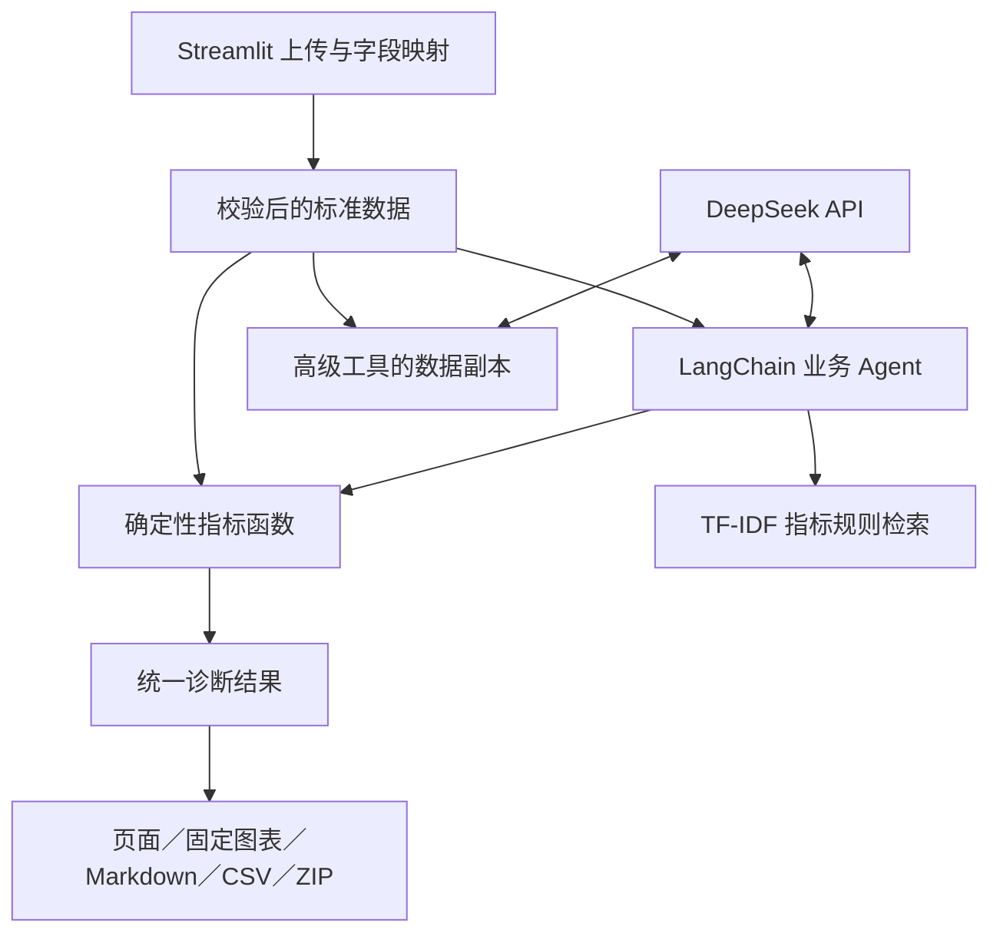

# 从零理解 CommerceSense：业务、源码、Agent 与面试

本文依据 `1c38034` 版本的实际代码编写。函数名比行号更稳定，后续修改后请优先按函数名定位。代码片段用于解释局部逻辑，不能全部单独运行；完整的无密钥演示在 `scripts/learn_project.py`。

阅读目标：能解释一次请求怎样从页面走到工具再返回结果，能手算并核对核心指标，能区分已实现功能和计划，能亲手修改一个工具并验证。读完一次不等于已经掌握全部 Python、LangChain 或所有面试题，下面的练习用于检验你真正理解了多少。

## 1. 先理解这个项目到底做什么

CommerceSense 是基于开源 DataSense 二次开发的电商经营分析应用。用户上传订单明细，完成字段映射后，可以查看经营指标，用自然语言比较周期、分析商品变化、查订单证据，检索指标口径，并下载经营周报。

适合的提问是：“9 月 2 日相比 9 月 1 日，净销售额变化多少？哪些商品贡献了变化？给我对应订单和规则说明。”

核心分工是：大模型理解问题、选择工具、组织语言；Python 工具筛选数据、计算指标；规则文档解释口径；页面把回答、工具结果、来源和报告展示给用户。

这不是训练了一个电商大模型，也不是把整份 Excel 直接丢给模型心算。它属于应用层 Agent 开发。主业务路径使用一个模型决策者和多个工具，没有实现多 Agent 协作、LangGraph 状态图、数据库或独立 FastAPI 服务。

“分析商品变化”是数值贡献分解，不是因果分析。某商品少卖了 100 元不能证明它缺货，也不能证明广告投放造成销售下降。

## 2. 页面里的功能分别对应什么实现

| 页面／功能 | 用户看到什么 | 核心实现 | 是否需要模型 |
| --- | --- | --- | --- |
| 数据导入 | 上传、币种、字段映射、质量摘要 | `commerce_data.py`、`commerce_session.py` | 不需要 |
| 经营概览 | 指标、周期对比、商品贡献、订单明细 | `commerce_metrics.py` | 不需要 |
| 分析助手 | 自然语言问题、连续追问、工具记录、来源 | `commerce_agent.py`、`commerce_conversation.py` | 业务问答需要 |
| 基础经营报告 | 固定图表、Markdown、CSV、ZIP | `commerce_diagnosis.py`、`commerce_report.py` | 不需要 |
| 可选 AI 解读 | 基于报告数字的附加文字 | `add_ai_interpretation()` | 需要 |
| 高级自然语言查询 | 模型生成 Pandas 操作，返回文字 | `answer_nlq_text()` | 需要 |
| 高级自由绘图 | 模型生成绘图代码，展示图片 | `generate_and_render_chart()` | 需要 |
| 高级数据处理 | 模型生成数据处理代码，下载结果 | `manipulate_dataframe_with_llm()` | 需要 |

纯模型身份问题由应用读取配置直接回答，不调用模型。高级工具处理数据副本，结果不会自动覆盖经营指标的数据，需要下载后重新上传。

## 3. 技术栈：每个名字解决哪个问题

| 技术 | 初学者解释 | 在项目中的实际作用 |
| --- | --- | --- |
| Python 3.12 | 实现应用逻辑的语言 | 文件读取、业务函数、模型调用与导出 |
| Streamlit 1.64.0 | 用 Python 写交互式网页 | 上传、表格、聊天、状态、表单和局部刷新 |
| Pandas 2.3.3 | 在代码里处理二维表格 | DataFrame、日期筛选、分组、去重计数、聚合 |
| Decimal 与 Python 整数 | 精确解析十进制与保存“分” | 避免核心金额累计依赖浮点数 |
| LangChain 0.3.30 | 连接模型、提示词、消息和工具的框架 | 主 Agent、Pandas Agent、绘图提示词链 |
| langchain-openai 0.3.35 | OpenAI 兼容协议的模型客户端 | 通过 `ChatOpenAI` 调用 DeepSeek 接口 |
| DeepSeek API | 托管模型服务 | 理解语言、提出工具调用、生成回答或代码 |
| scikit-learn TF-IDF | 根据文字特征检索相近内容 | 检索 Markdown 指标规则 |
| openpyxl 3.1.5 | 读取 Excel 工作簿的库 | Pandas 的 XLSX 读取支持 |
| Matplotlib／Seaborn | Python 绘图库 | 固定报告图与高级自由绘图 |
| unittest、Streamlit AppTest | 自动检查程序行为 | 指标、会话、真实编排、页面交互回归 |
| Git／GitHub | 修改记录与远端同步 | 代码版本和提交保存 |

版本来自 `requirements.txt`，是当前项目固定版本，不是“网上最新版本”。当前使用 LangChain 0.3 的执行方式，不能直接复制其他大版本教程而假设接口一致。

`langchain-openai` 的名字不表示实际调用的是 GPT。客户端采用的协议与服务端模型不是一回事。`ChatOpenAI(base_url="https://api.deepseek.com", model="deepseek-chat", ...)` 指向 DeepSeek。

当前没有用到向量数据库、Embedding 模型、Redis、SQL 数据库、LangGraph、MCP、模型微调或自主训练。不要为增加简历关键词把这些写成已实现。

## 4. 看源码前，掌握这些 Python 小知识

### 4.1 函数、参数与返回值

```python
def calculate_metrics(df, start, end):
    ...
    return metrics
```

`def` 定义函数；`df/start/end` 是输入；`return` 把结果交给调用者。传入同一份有效数据和同一周期，业务计算应得到相同结果。

### 4.2 字典与 DataFrame

```python
mapping = {"order_id": "订单编号"}
metrics = {"net_sales_minor": 40, "currency": "CNY"}
```

字典保存“键—值”。`mapping["order_id"]` 得到原始列名。`metrics["net_sales_minor"]` 得到 40，单位是分。

DataFrame 是带行列名称的表格。`df["quantity"]` 取数量列；`df.loc[mask]` 按真假条件选行；`groupby(...).sum()` 按组求和；`nunique()` 统计不同值数量；`head(10)` 只取前 10 行。

### 4.3 复制、异常和解包

`df.copy(deep=True)` 创建数据副本，避免普通工具操作直接改动会话中的标准表。它不是操作系统级隔离或安全沙箱。

`try/except` 捕获错误，`finally` 无论成功还是失败都会清理。例如金额解析失败要标记排除原因，模型超时要保留之前完成的工具结果。

`*current_period` 会把 `("2026-09-02", "2026-09-02")` 解包为两个参数。`**params` 把字典按参数名传进去。

### 4.4 装饰器、闭包和类

`@tool` 是装饰器，给普通函数增加“可作为 LangChain 工具”的能力。`@with_metrics_snapshot` 给业务计算增加解析结果复用的作用域。

`build_commerce_tools(df)` 里面定义的工具函数能访问外层的 `df`，这叫闭包。它让工具绑定当前用户的标准表，无需让模型传整张表。

`MetricKnowledgeBase` 是一个类，把规则文档、检索向量和检索方法放在一起。`DiagnosticResult` 是数据类，把一次诊断的所有输出放在同一个结果对象中。

先认识它们的作用即可，不必一开始就背 Python 语法细节。

## 5. 整体架构与阅读顺序



| 阅读顺序 | 代码入口 | 先理解的事 |
| --- | --- | --- |
| 1 | `app.py` → `commerce_ui.run_app` | 应用怎样启动、四个页面怎样组织 |
| 2 | `commerce_data.prepare_commerce_data` | 不同文件怎样变成同一种标准表 |
| 3 | `commerce_metrics.calculate_metrics` | 数字究竟从哪里来 |
| 4 | `model_config.create_chat_model` | 模型服务如何配置 |
| 5 | `commerce_agent.build_commerce_tools` | 普通函数怎样暴露给模型 |
| 6 | `build_commerce_agent` → `run_commerce_agent` | 模型怎样选择工具并得到结果 |
| 7 | `commerce_conversation.py` | 连续追问怎样保留周期和商品 |
| 8 | `rag_knowledge.py` | 规则怎样检索和引用 |
| 9 | `commerce_diagnosis.py` → `commerce_report.py` | 周报为何与页面数字一致 |
| 10 | `advanced_routing.py` → `advanced_tools.py` | 自由查询和绘图为什么不同 |
| 11 | `commerce_session.py`、`commerce_view_cache.py` | 换数据、重跑、缓存如何处理 |
| 12 | `tests/` | 这些行为怎样验证 |

`test_utils/`、原始 Notebook 和上游说明是保留的参考内容，不是当前主界面的主要执行入口。不要仅凭文件名字判断它正在运行。

## 6. 用三条订单理解整个业务

学习脚本使用以下模拟数据。两件商品名字都叫“杯子”，但商品编号不同。

| 订单号 | 商品编号 | 商品名称 | 数量 | 单价 | 日期 | 明细金额 |
| --- | --- | --- | ---: | ---: | --- | ---: |
| 001 | 01 | 杯子 | 3 | 0.10 | 2026-09-01 | +0.30 |
| 002 | 02 | 杯子 | 1 | 0.20 | 2026-09-02 | +0.20 |
| 003 | 01 | 杯子 | -1 | 0.10 | 2026-09-02 | -0.10 |

两天合计：成交销售额 0.50，冲销金额 0.10，净销售额 0.40，去重订单数 3，客单价四舍五入为 0.13 CNY。

以 9 月 2 日为本期、9 月 1 日为上期：本期净销售额 0.10，上期 0.30，变化 -0.20 CNY。

商品 `id:01`：本期 -0.10，上期 +0.30，变化 -0.40。商品 `id:02`：本期 +0.20，上期 0，变化 +0.20。合计变化 -0.20。

按变化绝对值排名，`id:01` 是第一名。接着问“查看该商品明细”，默认查看它在本期的订单 003。

这三个数字关系你必须能手算。否则即使会背 Agent、RAG，也无法判断系统回答是否正确。

## 7. 上传、字段映射和数据质量

对应 `commerce_data.py:55`、`:72`、`:106`、`:148`，以及 `commerce_session.py:34`、`:72`。

### 7.1 为什么先把 CSV 读成字符串

源码节选：

```python
pd.read_csv(uploaded_file, encoding="utf-8-sig", dtype=str, keep_default_na=False)
```

`dtype=str` 先保留原始文本。订单号 `001`、商品号 `01` 是标识，不是拿来加减的数字。读成整数后会丢前导零。数量和金额在后续校验阶段再转换。

UTF-8 失败后尝试 GB18030，兼容一些中文 CSV。XLSX 用 `read_excel` 读第一张表。Excel 文件里如果已经把编号保存成数字并丢掉前导零，读取时不能知道原来有几个零。

### 7.2 字段映射不是让模型猜

`infer_field_mapping()` 用别名字典匹配中英文列名。例如 `InvoiceNo`／“订单编号”都能对应 `order_id`。

```python
{"order_id": "订单编号", "quantity": "数量", "unit_price": "单价", "order_time": "日期"}
```

字典左边是应用统一使用的标准字段，右边是这份文件中的源列。页面允许手动修正。重新应用映射从原始表重新生成，先去除已有标准列再按映射添加，防止旧的标准列残留。

必填字段是订单号、数量、单价、订单时间。商品编号或名称至少有一个才能进行商品贡献；没有商品字段时仍可以查看整体指标。客户编号不是必填，缺失时不能声称算出了完整客户数。

### 7.3 为什么必须保存原始表和标准表

`commerce_raw_df` 是上传原表，`commerce_standard_df` 是映射和校验后的有效数据，`commerce_quality` 是质量摘要，`commerce_excluded_df` 是排除记录。

如果页面每次重跑都把原表重新赋给 Agent，就会发生“页面已经映射，工具却找不到 quantity”的错误。当前页面、主 Agent 和报告都取同一份标准有效表。

### 7.4 金额为什么用 Decimal 再转整数分

源码中先以字符串构造 Decimal，检查有限数值，再计算：

```python
minor = quantity * price * 100
if minor is not None and minor != minor.to_integral_value():
    errors.append("amount_precision")
```

普通二进制浮点可能把 `0.1 + 0.2` 表示为接近但不严格等于 `0.3` 的数。核心累计金额使用 Python 整数“分”，最终展示时再除以 100。

价格必须能表示到分；明细金额也必须能表示到分。`0.125 × 8.00 = 1.00` 有效，`0.5 × 0.01 = 0.005` 不足一分，会被排除，而不是静默舍入。单价 `0.100` 仍然等于 0.10，尾随零不构成多余的有效精度。

无效日期、空订单号、无效／非有限数量或单价、负单价等会留下排除原因。负数量保留为冲销。重复明细只提示，不自动删除。不能把冲销订单默默扔掉，也不能假定重复行一定是脏数据。

整数分是核心金额事实；部分页面列和绘图数值会转成浮点用于显示，不应据此误说“整个程序完全没有浮点数”。

## 8. 指标函数：模型拿到的数字从哪里来

对应 `commerce_metrics.py:58`、`:72`、`:110`、`:142`、`:198`。

### 8.1 日期筛选为什么是左闭右开

```python
start_ts = pd.Timestamp(start).normalize()
end_ts = pd.Timestamp(end).normalize() + timedelta(days=1)
mask = prepared["_valid_metric_row"] & (prepared["_order_time"] >= start_ts) & (prepared["_order_time"] < end_ts)
```

用户选 9 月 2 日到 9 月 2 日，程序实际筛选 `>= 9月2日00:00` 且 `< 9月3日00:00`。这样包含结束日全天，避免只计算到结束日零点。

### 8.2 核心公式

```python
amounts = period["_line_amount_minor"]
positive = amounts[amounts > 0]
negative = amounts[amounts < 0]
```

- 成交销售额：正明细金额求和。
- 冲销金额：负明细金额求和后取相反数，显示为正数。
- 净销售额：全部有效明细金额求和。
- 订单数：周期内 `order_id.nunique()`，包含冲销订单。
- 客单价：净销售额／周期去重订单数，没有订单时不适用。
- 变化率：`(本期 - 上期) / abs(上期) × 100%`，基期为零时不计算。

“订单数”不是表格行数，一个订单可能购买多个商品。当前口径也不是“正向支付订单数”，必须解释包含冲销订单。

### 8.3 商品贡献为什么需要编号、全量计算和补零

`product_contribution()` 对两个周期分别按 `product_key` 分组求和，使用两个周期商品集合的并集。某商品只在本期出现，上期补 0；只在上期出现，本期补 0。

`product_key` 优先是 `id:01`；没有编号时才是 `name:杯子`；编号和名称都空的明细保留为未填写组。这样不会漏掉金额，也不会把同名不同编号商品合并。

每件商品的变化是本期减上期，先计算全部商品，再按变化绝对值排名，最后截取 Top N。否则把 Top 10 之和当总变化，会丢掉其他商品的影响。

学习样例中贡献比例为：`id:01 = -0.40 / -0.20 = 200%`，`id:02 = +0.20 / -0.20 = -100%`。这不是 bug，而是正负变化抵消；比例不是因果影响概率。总变化为零时不计算比例。

## 9. 模型 API：到底是谁调用谁

对应 `model_config.py:25`、`:37`。

API 是程序间的调用接口。API Key 是服务凭证，`model` 是请求的模型名称，`base_url` 是服务地址。SDK 是帮你组织请求和解析响应的客户端库。

源码节选：

```python
options = {"model": settings.model_name, "api_key": settings.api_key,
           "temperature": 0, "timeout": MODEL_TIMEOUT, "max_retries": MODEL_RETRIES}
if settings.provider in {"DeepSeek", "OpenAI"}:
    from langchain_openai import ChatOpenAI
    if settings.provider == "DeepSeek":
        options["base_url"] = "https://api.deepseek.com"
    return ChatOpenAI(**options)
```

这里没有在本地部署 DeepSeek 权重。Python 通过客户端访问远端模型服务。没有训练模型；也不因安装 LangChain 就拥有一个模型。

温度 0 用于减少输出随机性，但不保证每次响应完全一致，也不保证不会产生错误。超时为 45 秒，最多重试 1 次；这是单次模型请求的配置，和 Agent 的决策轮数不同。

会话中填写的 Key 优先，留空时读进程环境变量。页面不把 Key 写入进程环境变量，避免会话之间互相覆盖。`safe_error()` 在显示异常前隐藏已知密钥。这不等于完成了一套生产级身份认证或秘密管理系统。

“你是什么模型”读取应用配置直接回答，因为模型自称 Claude 不能证明服务端实际使用了 Claude。同样，显示 `deepseek-chat` 是配置事实，不是对服务端内部实现的独立鉴定。

## 10. Agent：整个项目最重要的一条执行链

对应 `commerce_agent.py:51`、`:183`、`:216`，页面入口 `commerce_ui.py:250`。

### 10.1 普通模型、Chain、Agent 的区别

普通模型调用：程序把消息发给模型，得到一次响应。

固定 Chain：程序预先规定步骤，例如“提示词 → 模型 → 代码字符串解析”。自由绘图主要是这类链。

工具调用 Agent：模型根据当前问题和工具描述提出工具调用，执行器运行对应 Python 函数，再把结果交给模型；模型决定继续用工具还是结束回答。

不是每个调用模型的功能都叫 Agent。报告的可选 AI 解读就是基于确定事实的一次模型调用，不是新的多 Agent 系统。

### 10.2 六个业务工具

| 工具名 | 作用 | 最终执行的业务逻辑 |
| --- | --- | --- |
| `get_period_metrics` | 一个周期的指标 | `calculate_metrics` |
| `compare_period_metrics` | 两个周期对比 | `compare_periods` |
| `rank_product_contribution` | 商品变化排名 | `product_contribution` |
| `drilldown_orders` | 订单证据 | `order_drilldown`，对话最多返回 100 条 |
| `retrieve_metric_rules` | 检索指标口径 | `MetricKnowledgeBase.retrieve` |
| `diagnose_business` | 一次完整经营诊断 | `run_diagnosis` |

主 Agent 只能通过这些已注册工具工作，没有直接暴露任意 Python 执行器。高级查询的 Pandas Agent 才有代码执行工具，两条路径不能混淆。

### 10.3 `@tool` 到底做了什么

源码节选：

```python
@tool
def get_period_metrics(start: str = "", end: str = "") -> str:
    """计算日期范围内的销售额、冲销、净销售额、订单数和客单价；省略日期时使用当前分析周期。日期格式 YYYY-MM-DD。"""
    try:
        params = effective_tool_input("get_period_metrics", {"start": start, "end": end}, context)
        return serialise_payload(calculate_metrics(df, **params))
    except Exception as exc:
        return serialise_payload({"error": str(exc)})
```

函数名成为工具名称，文档字符串说明用途，类型标注帮助生成参数结构。模型主要看到这些工具描述和参数规范，不会在远端自动执行本地 Python 源码。

当模型提出 `get_period_metrics` 和日期参数后，LangChain 在本地调用该函数。`calculate_metrics` 完成计算，`serialise_payload` 把字典或 DataFrame 转成 JSON 文本供模型读取。

### 10.4 Tool Calling 不是模型自己运行了代码

下面是 LangChain 规范化后的工具请求示意，不是截取用户真实 API 日志：

```json
{
  "name": "get_period_metrics",
  "args": {"start": "2026-09-02", "end": "2026-09-02"},
  "id": "call_example",
  "type": "tool_call"
}
```

它相当于模型说：“请应用执行这个函数，并把结果告诉我。”真正执行者是你的 Python 程序。原始 OpenAI 兼容 HTTP 响应通常在 `function.name` 和 `function.arguments` 中表示调用，LangChain 会转换成上面更方便使用的 `AIMessage.tool_calls`。

模型没有拿到数据库密码后自己进服务器查数据，也没有把完整 Python 函数运行在 DeepSeek 服务里。

### 10.5 提示词里的四种位置

`build_commerce_agent()` 组合：

```python
prompt = ChatPromptTemplate.from_messages([
    SystemMessage(content=system_prompt),
    MessagesPlaceholder(variable_name="chat_history"),
    ("human", "{input}"),
    MessagesPlaceholder(variable_name="agent_scratchpad"),
])
```

`system_prompt` 规定助手身份、工具使用、日期和口径等行为。`chat_history` 放以前的用户问题、回答和实际工具证据。`input` 是这一次的问题。`agent_scratchpad` 是当前一轮执行时工具调用和结果等中间消息的占位位置，不等于应用必须展示的模型内部推理。

系统提示词可以引导模型，但不是证明模型绝对遵守的机制。确定性计算、实际工具记录、异常处理和测试才让结果有核对依据。

### 10.6 执行器负责循环

源码节选：

```python
agent = create_tool_calling_agent(model, tools, prompt)
return AgentExecutor(agent=agent, tools=tools, verbose=False, max_iterations=max_iterations,
                     max_execution_time=120, early_stopping_method="force",
                     return_intermediate_steps=False, handle_parsing_errors=True)
```

`create_tool_calling_agent` 组装决策所需的模型、工具规范和提示词。`AgentExecutor` 管理调用循环、工具执行和停止条件。

一次可能的教学流程是：

```text
问题：比较两个周期的销售情况，说明净销售额口径
  → 模型请求 compare_period_metrics
  → Python 返回对比表
  → 模型请求 retrieve_metric_rules
  → 检索器返回真实规则原文
  → 模型根据两次结果生成回答
```

这只是可能流程，真实模型不保证每次选择完全相同的工具顺序。固定完整诊断内部的计算顺序则由 `run_diagnosis` 决定。

主 Agent 默认最多 6 轮决策迭代，一轮可能提出多个工具调用，因此不能简单说“最多执行 6 个工具”。120 秒在轮次边界检查，不是能立即中断所有网络请求的硬时间限制。高级查询的限制是 4 轮，不是主 Agent 的 6 轮。

### 10.7 工具执行记录和失败处理

`ToolExecutionRecorder` 通过回调记录工具名称、有效输入、结构化输出及状态。`run_commerce_agent` 返回：

```text
answer        最终回答
tool_calls    实际工具输入和输出
rule_sources  实际返回的规则来源
error         错误或部分失败提示
context       本轮最终使用的周期与商品
currency      币种
model_identity 当时的模型配置
```

如果先算出了指标、后面的模型请求超时，已经完成的工具结果仍保留，问题也可以重试。页面不把模型内部思考过程当成结果展示。

这属于执行可追溯性，但目前没有实现生产级集中日志、分布式追踪平台或长期审计存储。

## 11. 连续追问：为什么“该商品”不会完全依赖模型猜

对应 `commerce_conversation.py:13`、`:64`、`:80`，以及 `commerce_agent.effective_tool_input`。

当前记忆由两部分组成：历史消息和明确的业务条件字典，不是向量长期记忆，也没有单独部署 Memory 服务。

```python
{
    "current_start": "2026-09-02",
    "current_end": "2026-09-02",
    "previous_start": "2026-09-01",
    "previous_end": "2026-09-01",
    "product_key": "id:01"
}
```

`resolve_analysis_context()` 使用页面日期、上轮条件和当前问题里的完整日期／商品标识形成条件。明确新日期优先；没有明确日期且页面周期未变化时沿用上轮；初次提问使用页面周期。比较周期缺省时使用相邻等长周期，或使用页面选择的对比周期。

支持明确的 `YYYY-MM-DD`、`YYYY/MM/DD`、`YYYY年M月D日`。当前没有可靠实现所有“上周”“最近半个月”等相对日期解析，不要夸大为任意自然语言时间都能正确理解。

`chat_history_messages()` 把历史转成 `HumanMessage`／`AIMessage`，并附带实际工具记录。`update_context_from_tools()` 再根据本轮实际执行条件更新状态；商品贡献排名后把第一名的 `product_key` 保存下来。

例如：第一问比较周期；第二问“继续按商品分析”，模型调用贡献工具但不提供日期时，用状态里的日期补齐；第三问“查看该商品明细”，补齐 `id:01`。

`effective_tool_input()` 是重要防线：问题明确指定日期或商品时，会强制采用这些明确条件。没有明确条件时，主要补齐模型省略的参数；模型如果主动给出其他日期，并不是所有情况都被硬性覆盖。因此需要展示真实执行周期，不能宣称完全消除了模型参数错误。

当前历史没有做 token 预算和摘要压缩，长对话会增加模型输入与成本。服务重启会丢失会话；换数据清理旧历史，防止把上一份表的答案用于新数据。

## 12. RAG：这个项目确实用了，但不是向量数据库版

对应 `rag_knowledge.py:15`、`:29`、`:50`、`:60`，知识文件 `knowledge/commerce_metrics.md`。

RAG 是 Retrieval-Augmented Generation，即检索增强生成。含义是先找相关外部资料，再把资料提供给模型生成回答。它不等于必须使用 Embedding API、FAISS 或 Milvus。

### 12.1 这里检索的是规则，不是订单库

规则文件按 `CS-001` 到 `CS-013` 分为 13 条，描述净销售额、冲销、订单数、客单价、商品贡献等口径。每条有标题、指标标识和版本。

`_load_documents()` 按规则标题拆分成 LangChain `Document`，把原文放入 `page_content`，规则编号、文件路径、行号和版本放入 `metadata`。这属于按业务语义边界切分，不是固定每 500 字切一块。

### 12.2 TF-IDF 怎样找到相近规则

源码节选：

```python
self.vectorizer = TfidfVectorizer(analyzer="char", ngram_range=(2, 5), sublinear_tf=True)
self.matrix = self.vectorizer.fit_transform([document.page_content for document in self.documents])
```

可以把它理解为：把文档里的文字片段编码成一串数字，常见于所有文档的片段区分度较低，能区分某条规则的片段更有价值。中文没有天然按空格分词，所以这里使用连续 2～5 个字符组成的片段。

检索时对问题做同样转换，然后计算：

```python
scores = (self.matrix @ self.vectorizer.transform([query.strip()]).T).toarray().ravel()
```

`@` 是矩阵乘法。此向量器默认进行 L2 归一化，点积可视为余弦相似度。程序按分数排序，最多取 4 条，并过滤低于 0.13 的结果。

TF-IDF 本质是词语／字符特征匹配，不能当作理解所有同义表达的语义检索模型。它也属于向量表示，但不是训练得到的稠密 Embedding 向量，更没有向量数据库服务。

### 12.3 为什么必须允许“不知道”

`retrieve()` 返回状态、命中原文、来源、分数和阈值。没有超过阈值的依据时返回“未找到规则”，避免无论问什么都强行引用最接近的一条。

阈值依据固定样本校准，当前有 16 条校准样本和 8 条独立验证查询。通过这些样本不能写成“RAG 通用准确率 100%”。新增规则或业务问题后应该重新校准。

### 12.4 检索和计算各管什么

“净销售额怎么算”检索规则，实际净销售额由 `calculate_metrics` 计算。改 Markdown 中的公式不会自动改 Python 函数。

自然语言助手通过 `retrieve_metric_rules` 进行相关性检索；完整诊断报告则通过 `RULE_BINDINGS` 按固定规则编号绑定说明。这两种来源组织方式不同，不能把报告所有引用都说成模型动态检索得到。

当前每次构建默认知识库会重新加载并建立这个小规则集合的索引，没有完成持久化向量索引或大型知识库增量更新。13 条规则足以采用简单实现，但规模增长后有优化空间。

## 13. 经营周报：为什么没有 Key 也能生成

对应 `commerce_diagnosis.py:38`、`:76`、`:159`，`commerce_report.py:160`，`report_ui.py:12`。

`run_diagnosis()` 是固定工作流，不是让模型自由决定报告每一步。它顺序执行：指标计算 → 周期对比 → 全部商品贡献 → 重点商品两个周期的订单证据 → 每日趋势 → 规则绑定与限制说明。

对账防线是：

```python
if available and sum(products["delta_minor"]) != current["net_sales_minor"] - previous["net_sales_minor"]:
    raise ValueError("商品变化与总净销售额变化不一致，已停止生成报告")
```

结果装进 `DiagnosticResult`，页面、固定图表和导出模块使用同一份结果。`frozen=True` 防止直接重新赋值字段，但内部 DataFrame 本身仍可修改；代码通过深复制形成快照，不能把它吹成绝对不可变对象。

报告默认预览前 10 商品，证据选择变化绝对值最大的前 3 商品。证据 CSV 包含这几个商品在两个周期的全部有效明细，不等于导出了所有商品的所有订单。对话工具的 100 行限制不应用到这份完整证据 CSV。

ZIP 包含 Markdown、指标 CSV、商品贡献 CSV、订单证据 CSV、每日趋势 CSV、两张 PNG 和 `manifest.json`。Manifest 保存周期、币种、质量计数、对账结果、规则来源和限制，便于复核。

`add_ai_interpretation()` 仅把计算好的事实交给模型写附加文字，不改指标公式和表格。AI 失败仍能下载基础报告。即便事实输入正确，模型文字仍需核对，不能宣称绝不会写错数字。

这是“先形成可靠事实，再做生成式表达”的设计，比让模型直接编一篇看似完整的经营周报更容易验证。

## 14. 高级工具：为何和主 Agent 不是同一种原理

对应 `advanced_routing.py:6`，`advanced_tools.py:409`、`:467`、`:558`。

| 路径 | 模型决定什么 | 本地怎样执行 | 主要输出 |
| --- | --- | --- | --- |
| 主业务 Agent | 在已定义业务工具中选择 | 固定函数计算 | 数字、证据和解释 |
| 高级自然语言查询 | 生成并执行 Pandas 操作 | LangChain Pandas Agent + `python_repl_ast` | 文字与工具记录 |
| 自由绘图 | 一次生成绘图代码 | 提示词链后执行代码 | Figure／图片／代码 |
| 数据处理 | 一次生成数据处理代码 | 执行后得到表格副本 | 表格预览与下载 |

这些路径可以共用同一个 DeepSeek 配置，差别在应用如何编排模型输出，不必分别购买不同的模型。

自由绘图的关键结构是：

```python
chain = prompt | model | StrOutputParser()
code = chain.invoke({"details": details, "viz_request": viz_request})
```

这里的 `|` 是 LangChain 的可运行对象组合：构造提示词、调用模型、把响应解析为代码字符串。不是 shell 管道，也不是 Agent 的多轮决策循环。

模型看到列名、类型和前 5 行样本，生成代码；实际运行针对完整数据副本。它不会仅因为提示词只有前 5 行，就只计算 5 行，但错误代码仍可能自己截断数据，因此要核对。

图形代码需要创建 `fig/ax`。当前使用 Agg 后端，避免 Tk／Qt 在 Streamlit 工作线程创建窗口而报错。返回 Figure 后用 `st.pyplot` 显示；兼容代码围栏、统一执行命名空间，避免推导式内找不到 `df`，空图明确报错。

“Agent stopped due to max iterations”表示高级查询用完 4 轮仍未结束；原来画图请求进入默认查询路径，且它只返回文字，即使画了图也没有传回页面。现在明确绘图请求由轻量规则转到自由绘图，不靠继续增加查询循环轮数解决。

主业务计算的公式在固定函数里；高级工具生成任意数据代码，不自动继承全部业务规则。测试里的柱状图金额核对正确，不表示以后每段模型生成代码都正确。

这些代码执行路径不是安全沙箱。关键词检查、受限 builtins 和提示词约束不能形成可靠的操作系统隔离；当前高级工具适合可信本地使用，不应在公网直接接受陌生用户任意指令。简历不要写“实现安全沙箱”。

## 15. Streamlit、状态和缓存：近期几次 bug 的真正知识点

对应 `commerce_ui.py:372`、`:301`，`commerce_session.py:34`、`:63`，`commerce_view_cache.py:4`，`commerce_metrics.py:21`。

### 15.1 交互为什么会重新执行 Python

Streamlit 的常见执行方式是用户交互后重新运行页面脚本。`st.tabs` 是界面组织，不意味着只计算当前可见页；代码里四个 tab 内的函数都会执行。

如果每轮重跑都解析 8 万行、重新计算多个周期，即使用户只是操作输入框，也会等待。这就是此前反复加载的主要代码原因。

`st.session_state` 是当前会话的状态容器，保存原表、标准表、消息、条件和报告。它不是持久数据库。浏览器新会话或服务重启后不能保证保留；不同用户也不应共享同一份全局表。

### 15.2 三种优化不要混淆

第一种是文件内容指纹：SHA-256 加扩展名判断文件是否变了，同内容不重复读取；变化时清理旧分析结果。

第二种是会话视图缓存：保存校验预览、概览、目录和明细。签名包含文件指纹、已应用映射、币种以及相应日期／商品条件；每种视图只保留最近结果。条件变化重新计算，不能只缓存到文件名，否则同名新文件会读旧结果。

第三种是单次计算快照：`metrics_snapshot` 使用 `ContextVar`，让一次诊断内部的多个函数共享一次解析结果，退出后恢复。它不是跨请求永久缓存，也不是 Redis。后续输入改变再调用时仍重新解析，避免读到过期金额。

### 15.3 表单和 fragment 各解决什么

`st.form` 把高级工具类型和需求一起提交，输入时不发送执行请求，按钮不再等待输入失焦后才启用。`@st.fragment` 让启用／关闭和提交更新高级工具区域，减少整页重跑。

模型网络请求、第一次导入和改变分析周期仍可能需要等待。缓存不会让远端模型瞬间回复。

### 15.4 为什么上次改好代码，实际页面仍慢

磁盘源码和运行中的 Python 导入模块不是同一概念。之前独立服务响应仍没有 fragment 标识、按钮仍是旧逻辑，说明旧进程保留了旧模块；健康接口 `ok` 只表示服务可用，不能证明代码已更新。

当前 `.streamlit/config.toml` 为本地开发启用轮询监控和保存后重跑，排除虚拟环境、数据和输出目录，并验证过实际加载。以后更新仍应检查真实服务行为，而不是只运行离线测试。

### 15.5 性能结果怎么正确表达

同一份 84,711 行月度数据，历史一次 AppTest 的输入后强制重跑从 15.102 秒降到 0.042 秒；实际本地服务开关曾测得约 0.08～0.14 秒。两者测量方法不同，不能混在一起算统一提升率。

这不是大模型推理速度优化，不是全链路问答延迟，也不是高并发压测。性能数字写简历时要保留数据规模、操作场景和单机验证条件。

## 16. 测试：你需要理解哪些是“真执行”，哪些是“模拟”

现有应用自动测试 64 项通过，范围记录在交互修复文档。数字是当前验证结果，不是项目质量的完整评分。

| 测试层 | 真正验证什么 | 不能据此证明什么 |
| --- | --- | --- |
| 数据与指标 | 编码、前导零、精度、冲销、日期、商品对账 | 任何输入都绝无边界问题 |
| 会话生命周期 | 重映射、换文件、历史清理与缓存失效 | 重启后的持久化记忆 |
| LangChain 链 | 执行器、工具参数、实际计算、历史消息、失败处理 | 真实 DeepSeek 一定选择相同工具 |
| RAG 样本 | 命中、无关查询拒绝、来源存在 | 通用语义检索成功率 |
| AppTest | 页面 Python 执行、控件、图像元素、下载与状态 | 全部浏览器视觉与交互兼容性 |
| 实际服务协议 | 上传接口、实际页面消息、fragment、代码更新 | 人眼完整浏览器验收或并发容量 |

`tests/fake_chat_model.py` 的 `ScriptedChatModel` 预先安排模型返回什么消息；LangChain 的执行器、真实工具、Pandas 和检索器仍然实际运行。因此可以稳定复现“先工具成功，再模型超时”。

模拟测试控制的是不稳定的外部模型传输，不是把所有业务结果也伪造。学习脚本明确标注模拟模型，不能把它算作真实 DeepSeek API 成功率。

真实 API 验收脚本 `scripts/verify_deepseek.py` 使用公开模拟数据，有 Key 才调用。没有 Key 显示 skipped；一次通过也只是一次特定问题通过，不等于所有多轮问答或自由绘图都验收完成。

目前没有形成足够规模的真实模型质量评测集，也没有高并发、云端完整部署和生产安全验收。浏览器自动化初始化失败的限制仍有记录。

## 17. 数据是否会发送到模型服务

主业务 Agent 的工具通常在本机处理标准表，再把结构化结果送入模型；订单下钻工具一次最多返回 100 行，但多轮历史可能累计这些证据。高级工具提示词包含列名、类型和前 5 行样本，高级查询运行后的工具输出也可能发送给模型。可选报告 AI 解读会发送报告事实。

因此不能说“所有订单数据绝不出本机”。精确说法是：本机负责数据处理，调用远端模型时会发送必要上下文、样本或工具结果；实际内容取决于所用功能。当前没有实现完整的脱敏策略、权限系统或数据保留管理。

## 18. 最值得你在面试里讲的五个设计

**模型与业务计算分工。** 模型做理解和工具选择，金额由确定性函数计算，减少语言模型直接心算出错；仍需要核对最终自然语言回答。

**自然语言记忆加显式条件。** 保存历史和周期／商品状态，工具参数在本地补齐或根据明确条件覆盖，追问能沿用证据。

**计算与知识说明分离。** Python 定义公式，版本化规则解释公式；检索有阈值和无结果状态，引用能追溯。

**统一诊断结果驱动多种输出。** 一份结果生成页面、图表和文件，商品变化与总变化对账，避免导出和页面各算一套。

**交互问题用测量定位。** 区分页面重跑、远端模型等待、旧服务代码与图形线程问题，不靠无限增加轮数掩盖失败。

## 19. 面试常见追问与准确回答

**为什么要 LangChain？** 它把模型客户端、工具描述、消息、Agent 循环和回调组织起来。也可以手写 HTTP 和工具分发，但需要自行处理消息格式、工具匹配和停止条件。业务公式仍由自己写的 Python 函数负责。

**为什么这算 Agent，不只是聊天机器人？** 模型能根据问题提出带参数的工具调用，执行器实际运行并把结果反馈给模型；不是只把问题发给模型生成文本。但报告内部是固定工作流，不应说每个部分都由 Agent 自主规划。

**为什么不用 LangGraph？** 当前单 Agent 和少量工具已可用，尚无复杂状态图、人工审批、持久检查点需求。LangGraph 是可选下一步，不是本项目已经实现的技术。

**为什么不用向量库？** 当前只有 13 条规则，字符 TF-IDF 简单、可解释、无需额外服务。缺点是同义表达和规模扩展能力有限，未来可以对比 BM25、Embedding 和混合检索后再选。

**怎样避免幻觉？** 关键数字来自固定工具，来源来自实际检索，失败保留状态，报告有对账；这些降低风险，不保证模型自然语言零错误。需要真实模型评测来检查是否乱改数字或编造原因。

**连续追问是怎么做的？** 历史消息加明确业务上下文，更新实际工具执行周期；贡献排名后保存商品标识。没有训练长期记忆，也没有把所有状态都丢给模型猜。

**退款怎么算？** 当前把负数量作为冲销明细参与净销售额，订单数包含周期去重后的冲销订单；原始业务的取消／退货／退款含义取决于数据，不能等同支付宝支付退款。

**为什么商品贡献超过 100%？** 正负商品变化相互抵消，分母是总净变化而非正向变化总和。三条教学订单中 -0.40 和 +0.20 合为 -0.20，所以分别是 200% 和 -100%。

**怎么证明不只是调接口？** 展示工具封装、参数优先级、整数金额、商品对账、规则来源、失败回调、报告复用和可重复测试。调用模型只是系统中的一层。

**项目最困难的地方是什么？** 可以讲你已实际复现并能解释的原始／标准数据错用、Streamlit 重算、运行服务未更新、Agent 轮次停止和绘图后端问题；不要编造用户规模或商业收益。

## 20. 目前能写进简历的版本

建议项目名称：**CommerceSense｜基于 LangChain 的电商经营分析 Agent**。

技术栈：**Python、LangChain、DeepSeek API、Pandas、Streamlit、TF-IDF RAG、Matplotlib**。

可根据你亲手完成并能够解释的部分改写下面内容：

> 基于开源 DataSense 二次开发电商经营分析应用，使用 LangChain Tool Calling 编排 6 个业务工具，支持周期指标对比、商品变化贡献、订单下钻及连续追问，展示工具参数、执行结果和规则来源。
>
> 实现订单字段标准化与数据质量校验，采用 Decimal 解析及整数分计算处理金额和冲销；以统一诊断结果生成页面、图表和 Markdown／CSV／ZIP 周报，并校验完整商品变化与总净销售额变化一致。
>
> 构建包含 13 条版本化指标规则的 TF-IDF 检索，支持相关性阈值拒绝与原文来源引用；通过 64 项自动测试覆盖数据、工具链、会话、报告和页面交互，并使用 84,711 行公开电商月度数据验证计算与绘图。

如果版面有限，保留前两条并精简第三条。64 项是当前应用测试通过数，不是 64 个真实用户问题；84,711 是公开月度明细行数，不是客户数量。不要写“提高业务营收”“99% 问答准确率”“生产级多 Agent”或“独立从零研发”，除非以后有对应事实。

AI 辅助实现并不妨碍学习和展示，但你应能独立解释、复现、改动和排查自己声称负责的部分。面试里承认开源二次开发和 AI 辅助，比无法解释依赖和代码更可信。

项目能展示 Agent 应用开发的相关能力，不能仅凭有项目就保证符合所有实习岗位。具体岗位可能还要求算法、数据结构、数据库、后端框架和实际部署能力，需要对照职位描述补齐。

## 21. 用学习脚本真正走一遍

在项目目录中执行：

```powershell
Set-Location C:\Users\zhuyiren\Desktop\zhuyiren\CommerceSense
$env:PYTHONIOENCODING = 'utf-8'
.\.venv\Scripts\python.exe scripts/learn_project.py
```

不需要 Key，不读取 Key，不访问真实模型服务，也不向你正在使用的浏览器会话导入数据。脚本调用与应用相同的业务函数，并使用现有确定性模拟模型驱动真实 LangChain 执行器。

你会依次看到：字段映射 → 标准数据 → 两天指标 → 周期对比 → 商品贡献 → 订单证据 → 规则检索 → 三轮 Agent 请求及工具结果 → 报告包文件列表。

生成的教学报告在 `outputs/learning_demo/report.md` 和 `report.zip`，不加入 Git。ZIP 解压后可查看图表及 CSV。

逐步跟踪调用时，可以先在以下位置设置断点：`prepare_commerce_data`、`calculate_metrics`、`get_period_metrics`／`compare_period_metrics`、`effective_tool_input`、`MetricKnowledgeBase.retrieve`、`run_diagnosis`。也可以暂时添加打印，观察参数和返回值，再恢复。

这个脚本中的模型回复事先安排，因此它不是训练代码，也不是证明 DeepSeek 在这些问题上一定正确。价值在于让你看到真正执行的 Python 链路。

## 22. 学到什么程度，才说明你能讲自己的项目

按顺序完成这些练习，每次先预测结果，再运行核对：

1. 不看代码手算三条订单的销售额、冲销、订单数、客单价和商品贡献。
2. 把商品 `02` 的数量改为 2，预测本期净销售额变为 0.30、总变化变为 0，再检查商品变化仍为 -0.40 和 +0.40，比例不适用。
3. 把订单号改成 `0002`，验证前导零保留；把日期改成无效文本，验证排除原因。
4. 不启动网页，直接调用 `calculate_metrics`，解释为什么不需要模型。
5. 只运行学习脚本，指出哪条模型消息请求了工具，哪一段本地代码真正计算，工具结果怎样进入下一次模型输入。
6. 检索“净销售额”和一个无关问题，解释阈值为什么需要返回未找到。
7. 连续问三次，打印 context，解释何时保存 `id:01`、何时换日期。
8. 新增一个你能手算的工具，例如某周期冲销金额／成交销售额比例，写清零分母处理；先写普通函数，再注册工具，最后验证模型调用。
9. 区分主 Agent、固定报告、Pandas Agent 和绘图 Chain，解释它们为什么能共用模型。
10. 指出当前没有哪些能力，并提出一个可验证的小改进，例如增加真实模型问题集、对话 token 预算或脱敏层。

完成前七项，说明你基本理解现有链路；能独立完成第八项并定位失败原因，比背诵项目介绍更能证明开发能力。实际模型的 API 费用和外发数据只在你主动做真实调用验证时产生，离线学习脚本不会产生这些调用。
